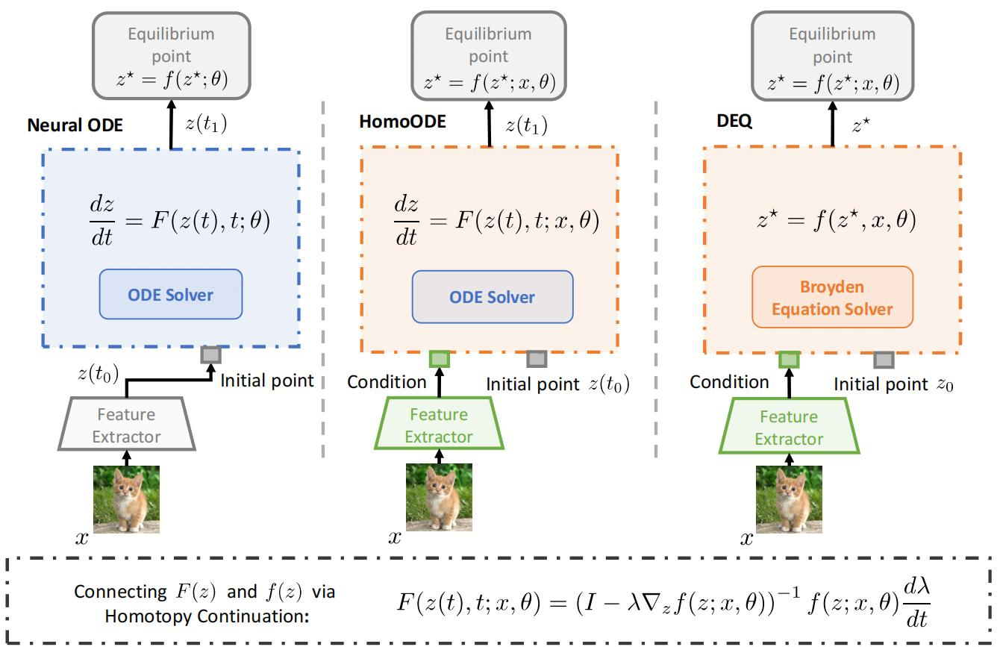

# [NeurIPS 2023] Two Sides of The Same Coin: Bridging Deep Equilibrium Models and Neural ODEs via Homotopy Continuation

Code release for **Two Sides of The Same Coin: Bridging Deep Equilibrium Models and Neural ODEs via Homotopy Continuation (NeurIPS 2023)**.

[[paper]](#) [[project page]](#)



## Requirements
```
numpy                         1.21.6
torch                         1.13.1
scipy                         1.9.1
```
## Preparation

To run the experiments, you need to first install the modified python package torchdiffeq via running `pip install -e .` in the current directory.

## Getting started
Then, you need to first run `cd scripts` to enter scripts directory of the project and then simply 

run `python homoinit_cifar10.py` to re-implement our experiments on CIFAR10 using HomoODE.

run `python homoinit_cifar100.py` to re-implement our experiments on CIFAR100 using HomoODE.

run `python homoinit_tiny.py` to re-implement our experiments on Tiny ImageNet using HomoODE.

Notably, you can obtain the Tiny ImageNet Dataset in [https://www.kaggle.com/competitions/tiny-imagenet/data](https://www.kaggle.com/competitions/tiny-imagenet/data). 

You need to download it and place it in directory `scripts/data/tiny-imagenet`.

## Acknowledgement
The implementation of HomoODE is based on [torchdiffeq](https://github.com/rtqichen/torchdiffeq). 

## Citation
If you find this repository useful in your research, please consider citing:

```
@inproceedings{
ding2023two,
title={Two Sides of The Same Coin: Bridging Deep Equilibrium Models and Neural ODEs via Homotopy Continuation},
author={Shutong Ding and Tianyu Cui and Jingya Wang and Ye Shi},
booktitle={Thirty-seventh Conference on Neural Information Processing Systems},
year={2023},
url={https://openreview.net/forum?id=R2rJq5OHdr}
}